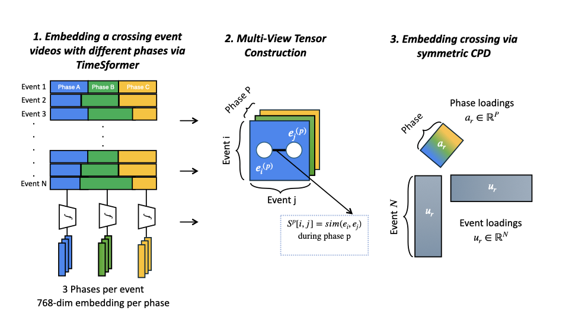

# Rail Crossing Behavior Signatures via Tensor Decomposition

Code and annotations for the paper:

> **Extracting and Analyzing Rail Crossing Behavior Signatures from Videos using Tensor Methods**
> Dawon Ahn, Het Patel, Aemal Khattak, Jia Chen, Evangelos E. Papalexakis
> arXiv:2602.16057 (2026), https://arxiv.org/abs/2602.16057

Railway crossing videos are segmented into behavioral phases, each phase is embedded with a pretrained video transformer, and the pairwise similarities are stacked into a multi-view tensor. A non-negative symmetric CP decomposition of that tensor yields interpretable behavioral components that can be read by phase, by crossing, and by time of day.



## Method

1. **Phase annotation.** Each video is manually segmented into five phases: Pre-event, Approach (warning lights on to gates down), Waiting (gates down to train clear), Clearance (train clear to gates up), and Post-event. Only Approach, Waiting, and Clearance are analyzed.
2. **Phase embeddings.** For every phase of every video, several 8-frame clips (stride 4) are passed through TimeSformer (`facebook/timesformer-base-finetuned-k400`). The phase embedding is the mean of the clip embeddings (768-d).
3. **Multi-view tensor.** For each phase, a 31 x 31 cosine-similarity matrix between video embeddings is computed. The three matrices are stacked into a 3 x 31 x 31 tensor.
4. **Rank selection.** CORCONDIA, reconstruction error, and holdout validation (10% masked entries) are compared across ranks. Rank 4 is used in the paper.
5. **Decomposition.** Non-negative symmetric CP decomposition (TensorLy, ALS, 2000 iterations, 5 random restarts, best fit kept). A gradient-based symmetric CPD (PyTorch) is included for comparison.
6. **Interpretation.** Phase loadings, per-video component loadings colored by crossing and time of day, and a t-SNE projection of the component space.

## Data

31 videos from 4 crossings in Lincoln, Nebraska, recorded February 2024.

| Crossing | Videos |
|---|---|
| 35th Street and Cornhusker Highway | 23 |
| NW 12th Street and Cornhusker Highway | 6 |
| 27th Street and Nebraska Parkway | 1 |
| 56th Street and Old Cheney Road | 1 |

Time-of-day labels: off-peak (7 PM to 6 AM), morning rush (6 AM to 10 AM), midday (10 AM to 3 PM), afternoon/evening (3 PM to 7 PM).

- The raw videos are **not distributed** with this repository. Place them under `data/<crossing>/` (the empty crossing folders are included) to rerun embedding extraction.
- Included: the phase annotations ([data/phase_annotations.json](data/phase_annotations.json)), the extracted TimeSformer phase embeddings (`data/phase_embeddings.pkl`) with their metadata ([data/phase_embeddings_metadata.json](data/phase_embeddings_metadata.json)), and the figures from the paper ([figures/](figures/)). With the embeddings included, the notebooks run without the videos.
- Not included: the CPD result pickles, which the main notebook regenerates.

## Repository layout

```
src/
  extract_phase_embeddings.py    TimeSformer phase embeddings
  tensor.py                      SymCPD (PyTorch) and NonNegativeSymCPD (TensorLy)
  analyze_annotations.py         Summary statistics and plot of phase durations
ipynbs/
  video_level_analysis.ipynb     Main analysis: tensor, CPD, non-negative CPD, figures
  rank_selection.ipynb           CORCONDIA / reconstruction / holdout rank diagnostics
  tsne_cpd_visualization.ipynb   t-SNE of the CPD component space
scripts/
  update_phase_annotations.py    Builds data/phase_annotations.json from the timing tables
  get_durations.py               Prints video durations
data/                            Annotations, metadata, and intermediate outputs
figures/                         Figures used in the paper
```

## Setup

Python 3.9 or newer.

```bash
pip install -r requirements.txt
```

## Reproducing the analysis

```bash
# 1. Extract phase embeddings (only needed to regenerate data/phase_embeddings.pkl; requires the videos)
python src/extract_phase_embeddings.py

# 2. Main analysis: similarity tensor, standard and non-negative CPD, component figures
jupyter notebook ipynbs/video_level_analysis.ipynb

# 3. Rank selection diagnostics and t-SNE (run after step 2)
jupyter notebook ipynbs/rank_selection.ipynb
jupyter notebook ipynbs/tsne_cpd_visualization.ipynb
```

All paths are relative to the repository root. Notebooks read from and write to `../data/`.

## Citation

```bibtex
@article{ahn2026railcrossing,
  title   = {Extracting and Analyzing Rail Crossing Behavior Signatures from Videos using Tensor Methods},
  author  = {Ahn, Dawon and Patel, Het and Khattak, Aemal and Chen, Jia and Papalexakis, Evangelos E.},
  journal = {arXiv preprint arXiv:2602.16057},
  year    = {2026}
}
```

## Acknowledgments

Research was supported by the National Science Foundation under grant no. 2431569 and by the University Transportation Center for Railway Safety (UTCRS) at UTRGV through the USDOT UTC Program under Grant No. 69A3552348340. Research was also supported in part by the National Science Foundation under CAREER grant no. IIS 2046086, and the CREST Center for Multidisciplinary Research Excellence in CyberPhysical Infrastructure Systems (MECIS) grant no. 2112650.

## License

Released under the MIT License. See [LICENSE](LICENSE).
